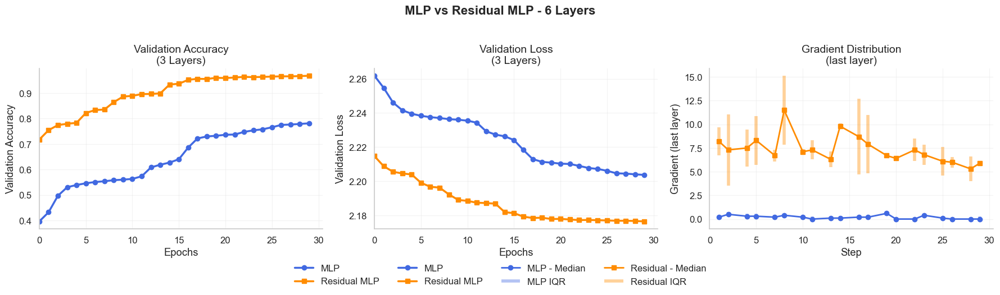

# Deep Learning Applications Laboratory #1 - README

## Overview

Welcome! This README walks through **my work starting from Exercise 1.1** of Laboratory #1 for Deep Learning Applications. I focused on writing my own modular implementations for MLPs, residual networks, CNNs, and knowledge distillation. You’ll find notes about my choices, lessons learned, and technical insights. 

## Exercise 1.1:

### The `DLModel` Wrapper:

#### Purpose

The `DLModel` class is a general-purpose, object-oriented wrapper for PyTorch models. The goal was to consolidate all the repetitive tasks of training, validating, and evaluating neural networks into a single interface that could be reused for any model (MLP, CNN, etc.) and any experiment. This avoids having to duplicate training loops or manually adjust scripts every time the network architecture or task changes.

#### Key Features

- **Device management**: The class takes care of moving the model and data to the correct device (CPU or CUDA) at initialization. 

- **Consistent data handling**: Training, validation, and test sets are defined at the class level. Data loaders are automatically created, and can be configured (e.g., number of workers, batch size, pin_memory) for performance.

- **Customizable training**: Supports both k-fold cross-validation (`train(k_folds=...)`) and single-run validation split (`train_once(val_percent=...)`). 

- **Early stopping**: Monitors validation accuracy (or other metrics) and halts training if no improvement is seen after a configurable number of epochs.

- **Learning rate schedulers**: Integrates with PyTorch’s learning rate schedulers (e.g., CosineAnnealingLR), updating the LR automatically during training if provided.

- **Mixed precision support**: If CUDA is available, the class will use `torch.cuda.amp.GradScaler` to enable mixed-precision training.

- **Wandb logging (optional)**: If enabled, all training metrics, validation metrics, losses, and learning rates are automatically logged to Weights & Biases.

- **Flexible loss/criterion**: The loss function is configurable, allowing use of standard or custom objectives.

- **Manual and automatic saving**: Best model weights (by validation accuracy) can be automatically saved at each fold or run.

- **History and plotting**: Training/validation losses and accuracies are stored for each epoch. Built-in methods provide ready-to-use plotting for single or multiple models.

- **Support for distillation**: The wrapper can handle training with both standard hard labels and knowledge distillation (combining hard and soft targets), and supports dynamic annealing of the loss mix coefficient (alpha) and temperature.

### Instantiating Models with `DLModel`

The `DLModel` should be considered a partial base class for the other models.
The derived classes (like `MultilayerPerceptron`, `ResidualMultiLayerPerceptron`, etc.) will implement the actual model architecture and its generation by using two key methods: `from_defaults` and `generate`. The first is a class method that functions as a factory for creating instances of the subclass, while the second is a static method that builds the actual PyTorch model based on a configuration dictionary.

#### `from_defaults`: Class Method for Configuration

- **Purpose**:  
  Provides a single entry point to instantiate a model with all typical/default hyperparameters and settings.  
  Every subclass of `DLModel` will implement its own `from_defaults` method, which will call the `DLModel.__init__` constructor.
  
  
- **How it works**:
  - You call, for example, `MultilayerPerceptron.from_defaults(dataset, hidden_sizes=[128, 64], epochs=20, ...)`.
  - This method collects all passed arguments (hyperparameters, dataset, etc.) and combines them into a configuration dictionary (`config`).
  - It then calls the class’s `generate(config)` static method to build the actual PyTorch model, using the config for all architecture-specific parameters.
  - Finally, it constructs and returns a full instance of the wrapper (`DLModel` subclass), filling in all relevant attributes (model, optimizer, loss, train/test split, etc.) using both the generated model and the arguments.

This approach allows for a clean call to create a model, by having three layers of parameter handling, making personalization possible but also keeping the base model creation straightforward:
1. **Positional arguments**: Required parameters that must be provided. (e.g., `dataset`).
2. **Explicit keyword arguments**: Keyword arguments that can have defaults (like `hidden_sizes` for an MLP) but have to be exposed in the method signature.
3. **Extra parameters**: Any additional parameters that are not explicitly defined in the method signature but can be passed as keyword arguments used for the configuration dictionary or the model wrapping.

#### `generate`: Static Method for Model Creation

- **Purpose**:  
  Handles the actual creation of the **PyTorch model** itself, based entirely on the contents of the config dictionary.  

- **How it works**:
  - Takes the config dictionary, which should contain all parameters needed to define the network (layer sizes, activations, dropout rates, shortcut mappings, etc.).
  - Constructs and returns a `nn.Module` (usually via `nn.Sequential` or a custom block), using the supplied configuration.

## The MLP model:
The `MultilayerPerceptron` class is a concrete implementation of the `DLModel` wrapper, specifically designed for multi-layer perceptron architectures.

---

## Exercise 1.2: Residual MLPs

### What I Did
- Created a **Residual MLP generator** (`ResidualMultiLayerPerceptron`) supporting arbitrary skip connections between any layers (not just one-per-two, like classic ResNet).
- Engineered a system where you can specify shortcut mappings (e.g. `{1: 0, 2: 0}` means layers 1 and 2 add the original input).
- Implemented a custom sequential container (`LinearResidualNetwork`) that handles all the skip-adding, projection (for mismatched dims), and integrates nicely into the DLModel pipeline.

### Bonus: Gradient Tracking
- Wrote hooks to track and plot the **median of the gradients** in the last layer during training.  
- *Result*: For deep MLPs, gradients in classic nets collapse toward zero; in residual nets, they stay healthy even late in training.

---

## Exercise 1.3: CNNs and Their Residual Variants

### What I Did
- Built a **highly parameterizable CNN generator** (`ConvolutionalNeuralNetwork`), able to stack any combination of conv/pool layers using configuration objects.
- Extended the OOP system to support **Residual Blocks** for CNNs, allowing for arbitrary depth and skip connections.
- Implemented a transform pipeline for CIFAR-10, including data augmentation (random crops and flips) + a label smoothing technique to improve generalization.

### Results
The CNNs achieved good accuracy on CIFAR-10 (85% max).

---

## Exercise 2.2: Knowledge Distillation (Hinton-style)

### What I Did
- Trained a **“big” CNN** on CIFAR-10 as a teacher.
- Created a **“small” CNN** and verified it performed worse when trained from scratch.
- Implemented a **distillation pipeline**:  
  - Saved teacher logits for the entire train set using a forward hook.
  - Adapted the training wrapper to combine hard labels (cross-entropy) and soft teacher outputs (KL-div, with temperature and alpha annealing).
  - Systematically explored the impact of temperature and alpha.
- Everything (distillation losses, alpha schedules, gradients, accuracy) tracked in wandb for post-mortem analysis.

### Results
The distilled small CNN achieved higher accuracy with a faster training, but the difference was not huge.

---

## Lessons Learned

- **OOP is powerful**: The `DLModel` wrapper and its subclasses let you focus on model design.
- **Good logging == good science**: Automating tracking (wandb, early stopping) 
    makes it easy to compare experiments and find what works.
- **Distillation is easy if you plan ahead**: Saving teacher outputs once speeds up repeated student experiments.

---
